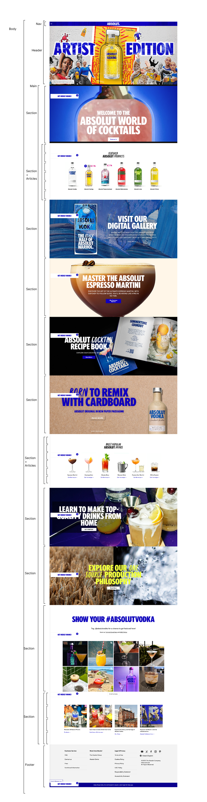
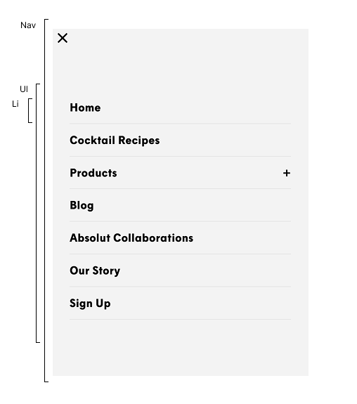

# Procesverslag
Markdown is een simpele manier om HTML te schrijven.  
Markdown cheat cheet: [Hulp bij het schrijven van Markdown](https://github.com/adam-p/markdown-here/wiki/Markdown-Cheatsheet).

Nb. De standaardstructuur en de spartaanse opmaak van de README.md zijn helemaal prima. Het gaat om de inhoud van je procesverslag. Besteedt de tijd voor pracht en praal aan je website.

Nb. Door *open* toe te voegen aan een *details* element kun je deze standaard open zetten. Fijn om dat steeds voor de relevante stuk(ken) te doen.

## Jij

  
uitwerken voor kick-off werkgroep

  ### Auteur:
  Stiene van Baggum

  #### Je startniveau:
  Rood

  #### Je focus:
  Surface plane
 

## Je website

  
uitwerken voor kick-off werkgroep

  ### Je opdracht:
  https://www.absolut.com/en/

  #### Screenshot(s) van de eerste pagina (small screen): 
  Home pagina
  

  #### Screenshot(s) van de tweede pagina (small screen):
  over ons pagina
   

## Toegankelijkheidstest 1/2 (week 1)

  
uitwerken na test in 2e Het is redelijk te doen om met de screenreader te navigeren door de website van Absolute Vodka. Wat me als eerste opviel was dat er allerlei linkjes werden uitgesproken in de bovenste 'banner' die niet te zien waren. Later zag ik dat dit allerlei H4's waren. Deze waren allemaal geschreven in capslock. Er zijn knoppen die niet worden uitgesproken zoals bij de espresso martini. Bij de detailpagina van de recepten wil de screenreader het recept niet voorlezen. Gelukkig wel bij het aankoopscherm. Verder hebben niet alle afbeeldingen alt teksten.

  ### Bevindingen
  - Veel read more zonder beschrijving
  - Veel titels die in de afbeelding verwerkt zijn
  - Als je uitzoomt schalen de afbeeldingen niet mee
  - Een url uit de css wilt niet laden
  - Titel van de pagina staat als class in de body
  - Er is een focus state aanwezig
  - De menu knop is erg klein
  - De knoppen zijn moeilijk leesbaar op mobiel (geen contrast)
  - Geen gebruik gemaakt van lijstjes
  - Niet overal een alt bij de afbeelding
  - Er is niet bij elke video een pauze knop
  - Geen darkmode
  - Geen gebruik gemaakt van ::selection colors

## Breakdownschets (week 1)

  
Week 1e werkgroep

  ### de hele pagina: 
  
  
  
  

## Voortgang 1 (week 2)

  
uitwerken voor 1e voortgang

  ### Stand van zaken
  Het gaan best goed, ik ben al lekker opweg met mijn eerste pagina. En verder heb ik de html voor pagina 2 ook al staan. Er zijn nog wel een paar dingen die er niet helemaal goed uitzien dus dat moet ik even vragen vandaag.

  ### Agenda voor meeting
  samen met je groepje opstellen

| Stiene                                            | Nicha                                         | Anne                                          | Kasper | Dylan                                               |
| ---                                               | ---                                           | ---                                           | ---    | ---                                                |
| omdraaien titel & rondddraaiend grid              | hero slide hoe beginnen                       | een element en dropdown button disable state  |        | hamburger menu 2 buttons & custom properties       |
| h2 en button & uit grid titel center              | Tabs dynamisch active en unactive             |                                               |        |                                                    |

  ### Verslag van meeting
  hier na afloop snel de uitkomsten van de meeting vastleggen
→ Ik heb geleerd hoe grid-column end en start werkt en hoe je dit kan gebruiken om overige elementen uit te sluiten in een section.

→ Ik heb ook geleerd hoe je kan zoeken is VScode met command F

→ Ik heb geleerd hoe je goed kan inspecteren in de inspector van google met het kopje in het vierkantje.

→ emmet cheatsheet

→list-style-type:””; ipv list: none voor de screenreaders

→flex-shrink is: 0 om te testen

→scroll-snap-type: x mandatory zodat er altijd een in het midden blijft staan

→ buttons aanbieden bij carroussel

## Voortgang 2 (week 3)

  
uitwerken voor 2e voortgang

  ### Stand van zaken
  Ik heb echt van die kleine dingen die niet lukken en waar de studenten helpers zich ook geen raad mee weten. Het voelt zo stom want het lijkt allemaal best wel simpel oplosbaar te zijn. Ik wil graag dat de website ook goed schaalt 

  ### Agenda voor meeting
  samen met je groepje opstellen

  | Dylan                     | Stiene            | Nicha              | Anne                                              | Kasper                                  |
| ---                       | ---               | ---                | ---                                               | ---                                     |
| grid kaartjes             | grid is kapot     | nintendo carousel  | Een ul zowel verticaal als horizontaal plaatsen   | Afsnijden van svg door font-size        |
| afbeelding scaling        |                   |                    |                                                   | SVG/Image in content zetten             |
|                           |                   |                    |                                                   | Kaart in section                        |

  ### Verslag van meeting
  - Ik heb geleerd over het picture element,
  - hoe object fit cover werkt
  - Ik begin heeel langzaam te begrijpen hoe grid werkt

## Toegankelijkheidstest 2/2 (week 4)

  
uitwerken na test in 9e werkgroep

  

  ### Bevindingen
  - Veel read more zonder beschrijving
  - Veel titels die in de afbeelding verwerkt zijn -- Alles heb ik een Alt gegeven
  - Als je uitzoomt schalen de afbeeldingen niet mee -- ik heb naast surfaceplane ook geprbeerd alles goed te laten schalen
  - Een url uit de css wilt niet laden -- Alles laat nu mooi in
  - Titel van de pagina staat als class in de body -- Titel gewoon bovenaan zoals het hoort
  - Er is een focus state aanwezig -- Die is er nog steeds
  - De menu knop is erg klein -- Ik heb deze wat groter gemaakt 
  - De knoppen zijn moeilijk leesbaar op mobiel (geen contrast) Ik heb de a'tjes op foto's een background-color gegeven.
  - Geen gebruik gemaakt van lijstjes -- Ik heb behoorlijk wat lijstjes gebruikt (kan er nu ook beter mee werken, dus heb er ook nog wat van geleerd:))
  - Niet overal een alt bij de afbeelding -- Dat heb ik wel toegevoegd
  - Er is niet bij elke video een pauze knop -- De video kon ik niet downloaden 
  - Geen darkmode -- Nu wel:)
  - Geen gebruik gemaakt van ::selection colors -- Ik heb met ::selection colors gewerkt en dit heb ik ook voor font toegevoegd.

## Voortgang 3 (week 4)

  
uitwerken voor 3e voortgang

  ### Stand van zaken
  Ik ben super bang dat het te weinig is en dat ik het allemaal niet goed doe. Maar om positief te blijven: beide pagina's staan en mijn test moet ik nog doen
   

  ### Agenda voor meeting
  samen met je groepje opstellen

  | Dylan               | Stiene              | Nicha | Anne                 | Kasper              |
| ------------------- | ------------------- | ----- | -------------------- | ------------------- |
| A1 joinen verdeling | picture stijlt niet |       | zoekvak fix          | grid kleiner        |
| grid verschuiving   | genoeg? 😬          |       | add shelf knop       | header details      |
| narrator menu issue |                     |       | footer afbeelding    | winkelkaart         |

  ### Verslag van meeting
  hier na afloop snel de uitkomsten van de meeting vastleggen

- oei oei, ik moet nog best veel doen om voor mijn eigen test te slagen.
- ik ga mijn carroussel nog maken en kijken waar ik tijd voor heb en wat het belangrijkste is
- ik ga kijken of ik de video nog erin kan zetten.

## Eindgesprek (week 5)

  
uitwerken voor eindgesprek

  ### Je uitkomst - karakteristiek screenshots:
  

  ### Dit ging goed/Heb ik geleerd: 
  Ik vind het nog steeds lastig maar wel leuk. Ik heb veel geleerd over wat netter coderen (nog steeds niet top) maar ik heb het gevoel dat ik het al beter snap dan de vorige codeer projecten. Dingen werken ook sneller dan eerst en ik begin meer na te denken over hoe ik iets kan maken. Kortom, het voelt logischer. In de praktijk heb ik geleerd over hoe je een site voor iedereen gebruiksvriendelijk maakt, hoe een screenreader werkt, hoe je een toggle switch maakt, en hoe je een grid en flexbox kan gebruiken. 

  

  ### Dit was lastig/Is niet gelukt:
  Het is me niet gelukt om de video er in te zetten, het is me niet gelukt omdat ik hem niet kon downloaden en omdat ik er geen tijd voor had gemaakt door werk(anders had ik er een andere video in kunnen zetten natuurlijk) Het is nu een stil uit het filmpje wat ook wel lekker rustig is.

  

## Bronnenlijst

  
continu bijhouden terwijl je werkt

  1. https://www.youtube.com/watch?v=VbNq_BUHCWI (uiteindelijk niets mee gedaan, maar toch)
  2. https://prismic.io/blog/css-text-animations (9. Wavy text)

  3. ChatGPT. (2025, 9 december). Uitleg over CSS-carousel, toggles en layoutproblemen [Persoonlijke communicatie]. OpenAI ChatGPT.
  4. ChatGPT. (2025, 8 december). Chatgesprek met gebruiker Stiene over CSS-afbeeldingsproblemen [Persoonlijke communicatie].
  5. ChatGPT. (2025, 8 december). Chatgesprek met gebruiker Stiene over CSS-afbeeldingsproblemen [Persoonlijke communicatie].
  6. ChatGPT. (2025, 3 december). Persoonlijke communicatie met gebruiker Stiene over light/dark mode toggle in HTML en JavaScript.
  7. ChatGPT. (2025, 1 december). Chatgesprek met gebruiker Stiene over het aanpassen van opacity in CSS [Persoonlijke communicatie].

